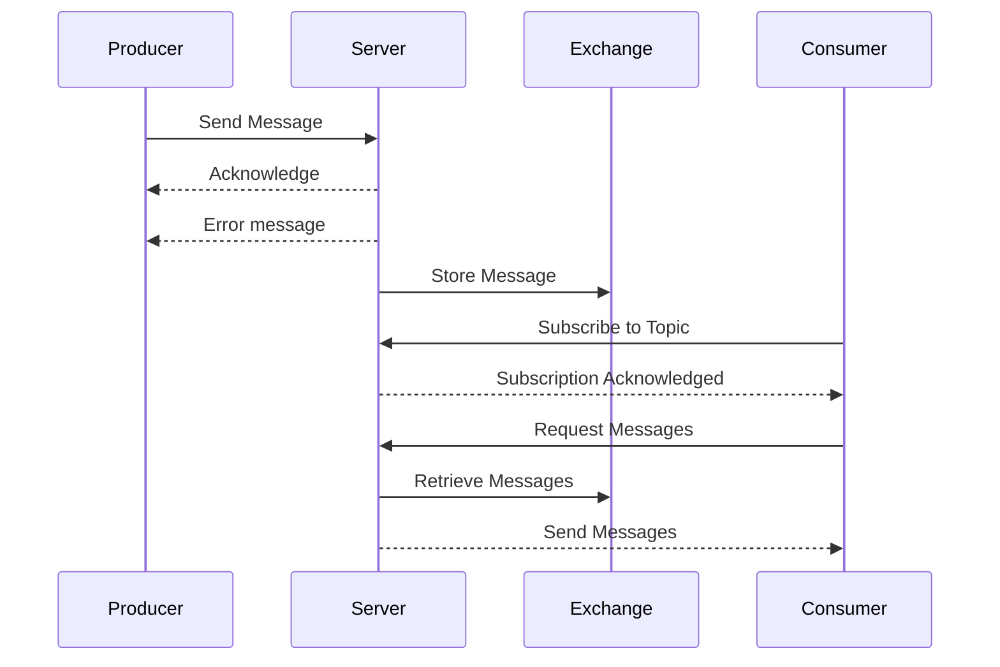
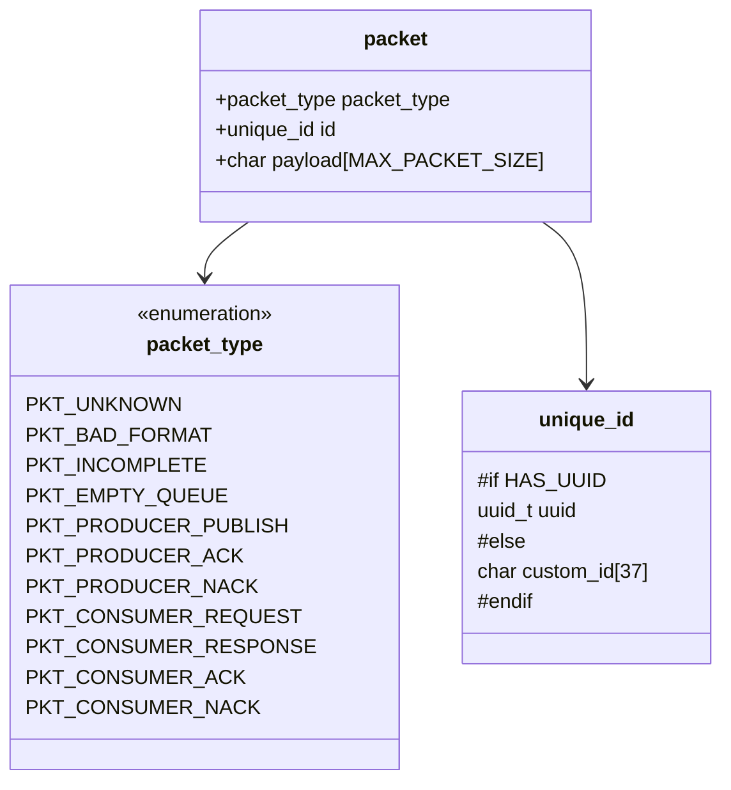
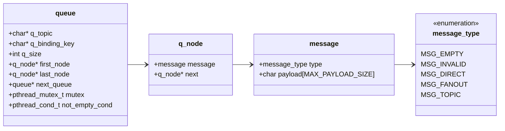
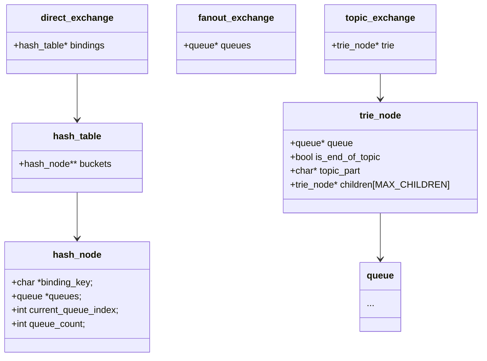

# PSOP - Sistem de Broker de Mesaje

# Tabelul conținutului

- [Prezentare generala](#prezentare-generala)
- [Instalare](#instalare)
- [Utilizare](#utilizare)
- [Fluxul Aplicatiei](#fluxul-aplicatiei)
- [Structuri de date](#structuri-de-date)
  - [Packet](#packet)
  - [Queue and Message](#queue-and-message)
  - [Exchange](#exchange-uri-si-structurile-de-date-folosite-de-aceastea)
- [Functionalitati viitoare](#functionalitati-viitoare)

## Prezentare generala

Acest proiect implementează un sistem de broker de mesaje, destinat facilitării schimbului de mesaje între **producători** și **consumatori** prin intermediul unui server centralizat. Sistemul este conceput pentru a permite producătorilor să trimită mesaje către server, iar consumatorilor să se aboneze la anumite chei sau topice pentru a primi mesajele relevante. Serverul gestionează distribuția mesajelor folosind un mecanism de exchange. Tipurile de exchange suportate includ **Direct Exchange** și **Topic Exchange**. Proiectul include componente pentru producători, consumatori și server, fiecare având roluri și funcționalități bine definite pentru a asigura un flux eficient de mesaje.

## Instalare

Ruleaza comanda **make** in directorul root al proiectului
```bash
make
```
In urma executarii comenzii vor fi create cele trei executabile: **server**, **producer** si **consumer**

> [!WARNING]
> Proiectul foloseste biblioteca [libuuid](https://github.com/util-linux/util-linux/tree/master/libuuid). 
> <br> Se recomanda instalarea ei, dar aceasta poate fi omisa deoarece este implementata o varianta proprie.<br>
> Biblioteca poate fi instalata astfel:<br>

### Debian, Ubuntu, Linux Mint
```bash
sudo apt install uuid-dev
```
### Fedora, RHEL, CentOS
```bash
sudo dnf install libuuid-devel
```
### Arch Linux, Manjaro
```bash
sudo pacman -S util-linux-libs
```
## Utilizare

### Pornire server
```bash
./server
```
### Rulati producatorul (sau consumatorul)
```bash
./producer ( or ./consumer)
```
## Fluxul aplicatiei

1. Producer:
   - creeaza si trimite mesaje in format JSON catre server
   - primeste si gestioneaza confirmari sau mesaje de eroare de la server
   - foloseste un mecanism de retry:
     + se incearca trimiterea pachetului de un anumit numar de ori la un inteval de timp care creste progresiv pana la primirea confirmarii de la server sau pana la epuizarea incercarilor
2. Server:
   + gestioneaza conexiuni multiple cu ambele tipuri de clienti
   + primeste mesaje de la producatori
   + stocheaza mesajele in functie de tipul mesajului (direct, topic, fanout)
   + primeste cereri de mesaje de la consumatori
   + trimite mesaje catre consumatori
4. Consumer:
   + trimite cereri pentru a primi mesaje
   + primeste mesaje de la server
5. Exchange:
   + stocheaza si gestioneaza mesajele aferente
   + exista 2 tipuri de astfel de exchange-uri
     - direct exchange: coada identificata printr o cheie
     - topic exchange: mesajele sunt rutate către cozi pe baza unui topic specific. Topicurile sunt definite ca șiruri de caractere separate prin puncte (.), de exemplu: sport.football, news.weather
  
## Structuri de date
### Packet

1. pachet_type
   + Tipul pachetului, definit printr-o enumerare packet_type. Aceasta indică scopul și conținutul pachetului.
   + Enumerarea packet_type include următoarele valori:
     - PKT_UNKNOWN: Tip necunoscut
     - PKT_BAD_FORMAT: Format greșit
     - PKT_INCOMPLETE: Pachet incomplet
     - PKT_EMPTY_QUEUE: Coada este goală
     - PKT_PRODUCER_PUBLISH: Publicare de către producător
     - PKT_PRODUCER_ACK: Confirmare de la producător
     - PKT_PRODUCER_NACK: Negație de la producător
     - PKT_CONSUMER_REQUEST: Cerere de la consumator
     - PKT_CONSUMER_RESPONSE: Răspuns către consumator
     - PKT_CONSUMER_ACK: Confirmare de la consumator
     - PKT_CONSUMER_NACK: Negație de la consumator
2. id:
   + Identificator unic al pachetului, definit prin structura unique_id. Acesta este utilizat pentru a urmări pachetele și a asigura unicitatea lor.
   + Structura unique_id poate conține:
     - uuid_t uuid: UUID (dacă este disponibil)
     - char custom_id[37]: ID personalizat (dacă UUID nu este disponibil)
3. payload:
   + Datele utile ale pachetului, stocate într-un array de caractere de dimensiune MAX_PACKET_SIZE. Aceste date reprezintă conținutul efectiv al pachetului, care poate fi un mesaj, o cerere sau alte informații relevante.
##
### Queue and Message

Mesage:<br>
1. type
   + Tipul mesajului, definit printr-o enumerare message_type. Aceasta indică scopul și conținutul mesajului.
   + Enumerarea message_type include următoarele valori:
       - MSG_EMPTY: Mesaj gol
       - MSG_INVALID: Mesaj invalid
       - MSG_DIRECT: Mesaj direct
       - MSG_FANOUT: Mesaj fanout
       - MSG_TOPIC: Mesaj topic
2. payload
   + Datele utile ale mesajului, stocate într-un array de caractere de dimensiune MAX_PAYLOAD_SIZE. Aceste date reprezintă conținutul efectiv al mesajului.<br>
##
Queue:<br>
+ Sincronizarea este realizată folosind mutex-uri și variabile de condiție pentru a gestiona accesul la cozi și pentru a semnala starea acestora (de exemplu, dacă o coadă este goală sau nu).
+ In cazul listelor de cozi este folosit algoritmul Round Robin pentru a asigura o distribuire echitabila.

1. q_topic
   + Topic-ul cozii, utilizat pentru a identifica mesajele care aparțin unui anumit subiect.
2. q_binding_key
   + Cheia de legătură a cozii, utilizată pentru a lega mesajele de coadă în cazul unui direct exchange.
3. q_size
   + Dimensiunea cozii, reprezentând numărul de mesaje stocate în coadă.
4. first_node
   + Primul nod din coadă, indicând începutul listei de mesaje.
5. last_node
   + Ultimul nod din coadă, indicând sfârșitul listei de mesaje.
6. next_queue
   + Următoarea coadă în listă, utilizată pentru a lega mai multe cozi într-o structură de tip listă.
7. mutex
   + Mutex pentru sincronizare, utilizat pentru a asigura accesul concurent sigur la coadă.
8. not_empty_cond
   + Condiție pentru a semnala că coada nu este goală, utilizată pentru a notifica consumatorii că sunt mesaje disponibile.
##
### Exchange-uri si structurile de date folosite de aceastea


Direct_exchange:<br>
1. bindings
   + Un tabel hash care leagă cheile de cozi. Fiecare cheie este asociată cu o coadă specifică. <br><br>

Topic_exchange:<br>
1. trie
   + Un trie pentru gestionarea topicelor. Fiecare nod din trie reprezintă o parte a unui topic și poate avea copii care reprezintă sub-topicuri. <br><br>

Fanout_exchange:<br>
1. queues
   + O listă de cozi către care sunt trimise mesajele. Toate cozile din această listă vor primi mesajele trimise către exchange-ul fanout. <br>

## Functionalitati viitoare
1. Server:
   - adaugare fanout exchange
   - creare de noi structuri care sa permita autentificarea consumatorilor si posibilitatea ca acestia sa se aboneze la anumite topice
   - posibilitatea monitorizarii cozilor prin comenzi din terminal
   - salvarea mesajelor pe disk pentru a asigura persistenta
2. Consumer:
   - posibilitatea de a se abona la un anumit topic
   - implementarea unui meniu care sa ofere utilizatorului posibilitatea de a crea cereri in linie de comanda
3. Producer:
   - implementarea unui meniu care sa ofere utilizatorului posibilitatea de a crea mesaje in linie de comanda
##
